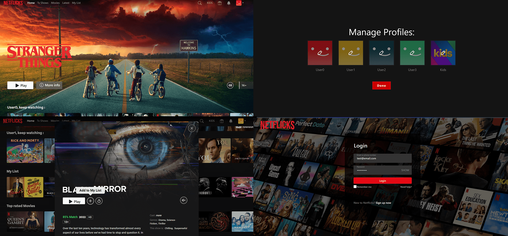

# Angular Netflix - Gluky

Angular Netflix - Gluky es una aplicación web construida con el framework Angular 17, diseñada para demostrar la programación reactiva con RxJS, la gestión de componentes con Nx en una configuración de monorepo, y un diseño responsivo utilizando Bootstrap y Swipe.js para las animaciones. Este proyecto aprovecha la [API de Tv Maze](https://www.tvmaze.com/api) y la [API de The Movie DB](https://developer.themoviedb.org/reference/intro/getting-started) para los datos, junto con el [Reproductor de YouTube](https://github.com/angular/components/blob/main/src/youtube-player/README.md) para la integración de videos.

## Vista Previa




---

## Tabla de Contenidos
- [Inicio Rápido](#inicio-rápido)
- [Objetivos](#objetivos)
- [Características](#características)
- [Tecnologías](#tecnologías)
- [Nx](#nx)
- [Pruebas](#pruebas-con-jest)
- [Linting](#linting-con-eslint)
- [Cosas a Saber](#cosas-a-saber)
- [Consideraciones Finales](#consideraciones-finales)
- [Soporte](#soporte)

## Inicio Rápido

Para configurar el proyecto localmente, sigue estos pasos:

```bash
yarn install
yarn start
